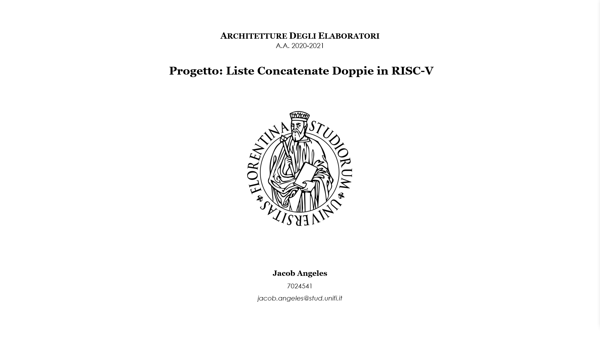
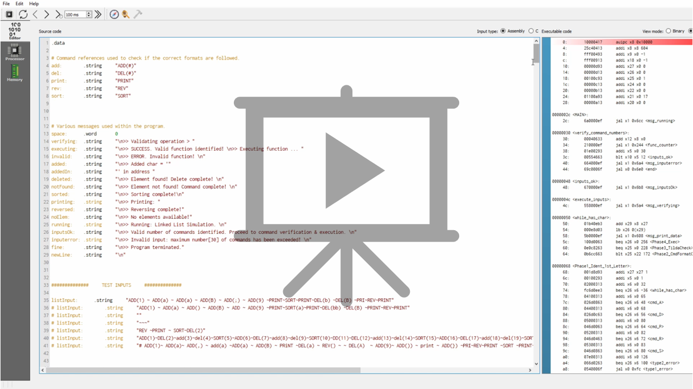

# RISC-V Project: Double Linked-list Simulation

## Overview
This project implements a RISC-V assembly program that processes a series of list manipulation commands provided as a single input string. The input string, declared as `listInput` in the `.data` section, contains commands separated by the `~` character (ASCII 126). The main function and associated functions handle commands to add, delete, print, sort, and reverse elements in a list.

## Features
- **ADD(char)**: Adds a new element with `DATA=char` to the end of the list.
- **DEL(char)**: Searches for and removes the first occurrence of an element with `DATA=char` from the list.
- **PRINT**: Prints all elements in the list in their current order.
- **SORT**: Sorts the list in ascending order.
- **REV**: Reverses the order of the list elements.

## Input Handling
- The input string, `listInput`, can contain up to 30 commands.
- Commands are separated by the `~` character.
- The program performs validation checks on the commands to ensure proper formatting and valid operations.

## Command Format
- **ADD and DEL Commands**: Must contain exactly one character within parentheses (e.g., `ADD(a)` or `DEL(b)`). Commands with zero or multiple characters in parentheses are considered malformed and are discarded.
- **Case Sensitivity**: Commands must be in uppercase letters (e.g., `PRINT` is valid, but `print` is not).
- **No Spaces in Commands**: Commands must not contain spaces within the command word (e.g., `SORT` is valid, but `SO RT` is not). However, spaces adjacent to the `~` separators are tolerated.
- **Examples**:
  - Valid: `ADD(a)~DEL(b)~PRINT~SORT~REV`
  - Invalid: `AD D(a)~DE L(b)~print~SO RT~REV`

## Assembly Code Structure
- **Main Function**: Processes the input string, delegates commands to respective functions, and handles overall list management.
- **Helper Functions**: Implement the logic for each command (ADD, DEL, PRINT, SORT, REV) and any additional necessary operations.

## Usage
1. Place the `listInput` string in the `.data` section of the RISC-V assembly code.
2. Ensure the input string follows the specified format and constraints.
3. Run the program to see the list manipulation based on the commands provided in `listInput`.

## Example Input
```
listInput: .string "ADD(a)~ADD(b)~PRINT~SORT~PRINT~REV~PRINT"
```

## Example Output
1. **Initial Input**: `ADD(a)~ADD(b)~PRINT~SORT~PRINT~REV~PRINT`
2. **Output**:
   ```
   a
   b
   -----
   a
   b
   -----
   b
   a
   ```

This README description outlines the functionality, input handling, command format, and usage of the RISC-V assembly project for processing list commands.

## Program Logic



## Test - Video Demo
[](./assets/tests.mp4)

## Documentation & Repository
You can download the complete documentation <a href="documentation.pdf">here</a>. The repository is available <a href="https://github.com/ngljcb/project_16310_riscv">here</a> for browsing all the project resources.